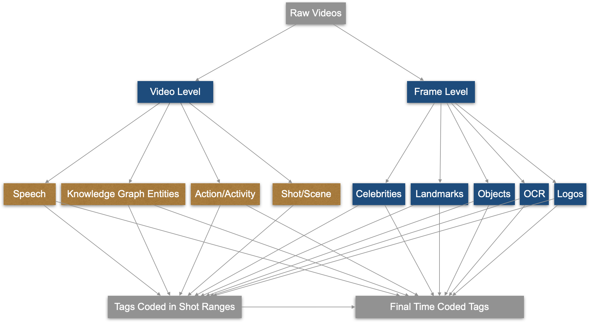

# Overview of the ML Inference Engine: Features and Fabric Integration

At Eluvio, we have developed a multi-modality inference engine for universal video context understanding, including both frame-level and segment-level features, as shown in Fig. 1. Specifically, the frame features include celebrities, landmarks, objects, optical characters/texts, and brands/logos, where we tag key frames and aggregate them to a time-coded format, specifying the start and end time for all tags. As for the segment features, we explore both knowledge graph entities and action/activities for each 5/10-second segments, which enrich semantic concepts and topics. Each feature consists of a single- or multi-stage deep neural network model trained from the ground up on either open-sourced or customized large-scale video/audio datasets.

*Fig. 1.  Multi-modality inference engine for  universal video context understanding*

#### Content Fabric Integration

The universal video context understanding has been deployed to the Content Fabric, as a native content tagging service. The service can be invoked either during content ingestion or afterwards using the tagger API. See [here](https://github.com/eluv-io/elv-tagger/blob/master/TaggerAPI.md) for its usage details.

The ML inference engine written in Python is hosted on Linux containers (LXC) and communicates with the Content Fabric through JRPC channels. It's exposed as a REST service. See Fig. 2. for workflow details.

*Fig. 2.  Design of the ML Serve using LXD, an LXC manager*

The native tagging service on the Fabric allows content viewers to do just-in-time clip queries based on the video metadata. It enables dynamic and personalized video/clip recommendation. The just-in-time programmatic capabilities of the Fabric together with the tagging service allow content providers to create customized clips, e.g. scene/topic/activity based clipping service leveraging content and audience metadata.

The tagging service could also be used to offer programmatic automation of many manual media curation tasks, including automatic identification of credits via OCR, thumbnail or “poster” generation from key frames, identification of key brands/sub-franchise or activities for advertising insertion, and automatic identification of localization requirements (e.g. banned scenes). Here is a query example of "boxing" scenes extract from the Creed movie. Both the OCR and segment features have relevant clips, which one can future do clipping and advertising insertion.

*Fig. 3.  Use case of the tagging service*
